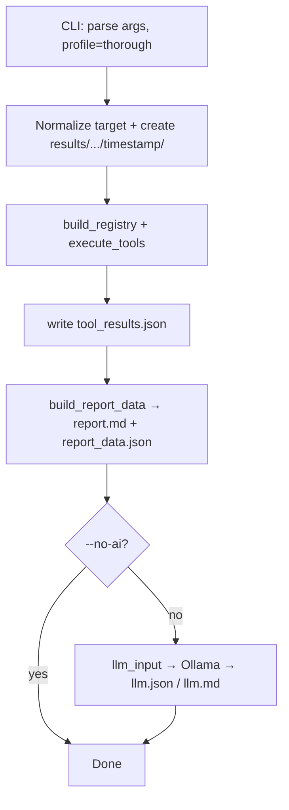
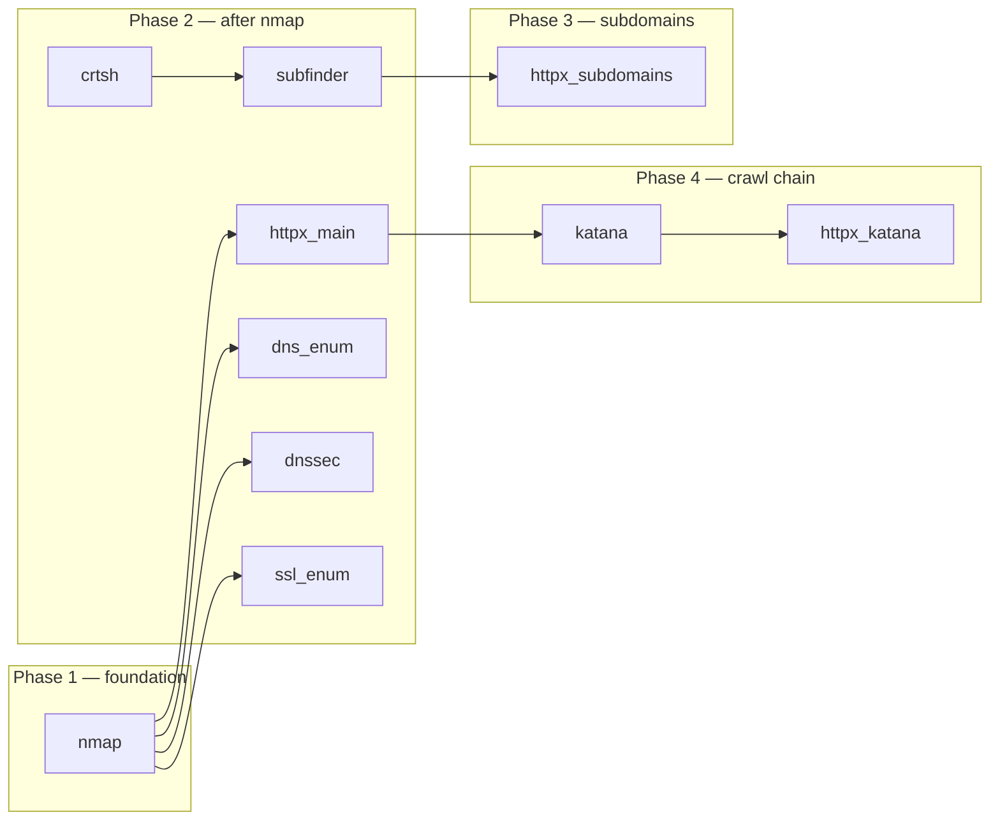

# Thorough profile — tool flow

High-level view of what runs when Somniosus is invoked with `--profile thorough` (non-interactive, default flags).

```bash
./somniosus.py example.com --profile thorough
```

For the full CLI reference, see [README.md](README.md) and [docs/CLI_MODES.md](docs/CLI_MODES.md).

---

## Profile tool list

Defined in `somniosus.py`:

| Profile   | Tools |
|-----------|-------|
| **safe**  | nmap, httpx_main, crtsh, subfinder, dns_enum, **whois**, httpx_subdomains |
| **thorough** | nmap, httpx_main, crtsh, subfinder, dns_enum, **dnssec**, **ssl_enum**, httpx_subdomains, **katana**, **httpx_katana** |

Compared to `safe`, thorough **adds** dnssec, ssl_enum, katana, and httpx_katana, and **does not include** whois.

Tools **not** in thorough (require interactive menu, `--full`, or `--run <tool>`): nuclei, ffuf, dnstwist, tldx, whois_tldx.

---

## End-to-end program flow



Layers (unchanged from project architecture):

```
somniosus.py → core/registry.py → core/plugins/* → adapters/* → external binaries
```

---

## Execution order (dependency planning)

The registry (`core/registry.py`) orders tools by `requires` / `provides`, then runs them **sequentially**, updating shared `State` after each step.



Within a planning round, tools that share the same dependencies run in **profile list order**. **crt.sh runs before subfinder** so subfinder can merge CT subdomain names.

| Step | Tool | Requires | Primary outputs / state |
|------|------|----------|-------------------------|
| 1 | **nmap** | — | `state.nmap`, `findings.json` (open ports) |
| 2a | **crtsh** | — | `extras.crtsh`, passive subdomains |
| 2b | **subfinder** | — (merges crt.sh) | `state.subfinder`, `subfinder.json` |
| 2c | **dns_enum** | nmap, DNS port 53 | `dns_enum.json` |
| 2d | **httpx_main** | nmap, web ports | `httpx.json`, `extras.web.live` |
| 2e | **dnssec** | nmap | `dnssec.json` |
| 2f | **ssl_enum** | nmap, port 443 open | `ssl_enum.json` |
| 3 | **httpx_subdomains** | subfinder (`subdomains`) | `httpx_subdomains.json` |
| 4 | **katana** | httpx_main, live web URLs | `katana.json`, `extras.web.urls.discovered` |
| 5 | **httpx_katana** | katana URLs | `httpx_katana.json`, validated URLs |

---

## Phase-by-phase behavior

### Phase 1 — Port scan (nmap)

- Adapter: `adapters/nmap_scan.py`
- Seeds baseline **`findings.json`** from open ports and services.
- Downstream tools use `state.nmap` for web/DNS port heuristics.

### Phase 2 — Discovery and main-target web probe

**crt.sh** (passive)

- HTTP API; no local binary.
- Skipped if target looks like an IP.
- Subdomains stored in `extras.crtsh`.

**subfinder**

- Skipped if target looks like an IP or binary missing.
- Merges **crt.sh** subdomain list into its result when crt.sh already ran.
- Sets `state.subfinder` and writes `subfinder.json`.

**dns_enum**

- Uses `dig` when nmap shows port 53 and target is a domain.
- Writes `dns_enum.json`.

**httpx_main**

- Runs when common web ports (80, 443, 8080, etc.) are open.
- Probes `http://` and `https://` for the CLI target.
- Adds live URLs to canonical bucket `extras.web` via `helpers.web_add_source(..., kind="live")`.
- Unless `--include-subdomains`, URLs are scoped to the CLI target.

**dnssec** / **ssl_enum**

- dnssec: DNSSEC validation via `dig`.
- ssl_enum: certificate/TLS enumeration when **443** is open.
- See [Interactive-only gating](#interactive-only-gating) below.

### Phase 3 — Subdomain probing (httpx_subdomains)

- Requires a non-empty subdomain list from subfinder.
- Probes up to **`--max-subdomains`** hosts (default **50**).
- Runs in both `safe` and `thorough`; **not** controlled by `--include-subdomains`.
- Writes `httpx_subdomains.json`.

### Phase 4 — Crawl chain (thorough-specific)

**katana**

- `should_run()` requires `profile == "thorough"` and live web roots from httpx_main.
- Crawls live URLs; stores discovered paths in `extras.web.urls.discovered`.
- Unless `--include-subdomains`, discovered URLs are scoped to the CLI target.

**httpx_katana**

- Re-probes URLs katana discovered.
- Adds results to `extras.web` as validated URLs.

---

## Canonical web state (`extras.web`)

httpx_main, katana, and httpx_katana populate a shared structure (see `core/helpers.py`):

```json
{
  "roots": [],
  "live": [],
  "sources": { "<tool>": ["..."] },
  "urls": {
    "discovered": [],
    "validated": []
  }
}
```

This bucket chains **live roots → katana crawl → httpx validation**.

---

## Runtime skip conditions

A tool in the profile list may still be **skipped** at runtime:

| Tool | Common skip reasons |
|------|---------------------|
| httpx_main | `httpx` not on PATH; no web ports in nmap |
| crtsh / subfinder | target looks like an IP |
| dns_enum | no `dig`; DNS port not open; IP target |
| ssl_enum | port 443 not open |
| httpx_subdomains | no subdomains; no `httpx` |
| katana | wrong profile; no `katana` binary; no live web URLs |
| httpx_katana | no katana-discovered URLs |

Skipped tools are recorded in **`tool_results.json`** with `skipped: true` and a `reason`.

---

## Interactive-only gating

**dnssec** and **ssl_enum** are marked `interactive_only = True` in their plugins.

On a plain non-interactive run:

```bash
./somniosus.py example.com --profile thorough
```

the registry **does not execute** them; it records a skip with reason `interactive-only (run with --interactive)`.

To run them, use one of:

- `--interactive` (menu or bundle flow)
- `--full` / `--full-quiet` (sets `interactive` internally)
- `--run dnssec` or `--run ssl_enum` (single-tool mode)

This differs from the README table that lists dnssec/ssl_enum under thorough — the profile **requests** them, but interactive mode is required for them to **run** unless that gating changes in code.

---

## Scope: CLI target vs subdomains

| Behavior | Default (`thorough` only) | With `--include-subdomains` |
|----------|---------------------------|-----------------------------|
| httpx_main URL scope | CLI target only | Expanded per plugin logic |
| httpx_subdomains | Probes discovered subs (capped) | Same (always runs on subs) |
| katana / httpx_katana | URLs filtered to CLI target | Subdomain URLs included |

Heavy vuln tools (nuclei, ffuf) are **not** in the thorough profile; they follow the same scope rules when enabled via other modes.

---

## Artifacts after the tool pipeline

Under `results/<target>/<timestamp>/`:

| File / dir | Description |
|------------|-------------|
| `findings.json` | Baseline structured results (nmap + merged vuln findings if any) |
| `tool_results.json` | Per-tool execution metadata |
| `<tool>.json` | Per-tool structured output (e.g. `httpx.json`, `subfinder.json`) |
| `raw/` | Unmodified tool stdout/files |
| `report.md` | Deterministic hybrid report |
| `report_data.json` | Structured report model |
| `report_legacy.md` | Legacy report format |
| `llm_input.json`, `llm.json`, `llm.md` | Optional; omitted with `--no-ai` |

---

## Related modes (not thorough)

| Mode | How it differs |
|------|----------------|
| `--profile safe` | No katana/httpx_katana; includes whois; no dnssec/ssl_enum in profile list |
| `--interactive` | Menu-first; can run discovery/vuln bundles |
| `--full` | Thorough + dnstwist, tldx, whois_tldx, nuclei, ffuf; subdomains + `tld-preset all` |
| `--run <tool>` | Single tool + dependencies; AI disabled |

---

## Source references

- Profile lists: `somniosus.py` (`PROFILES`)
- Execution engine: `core/registry.py` (`execute_tools`, `plan`)
- Plugin metadata: `core/plugins/*.py`
- Web URL bucket: `core/helpers.py` (`ensure_web_bucket`, `web_add_source`)
